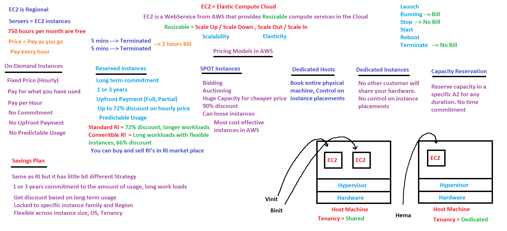
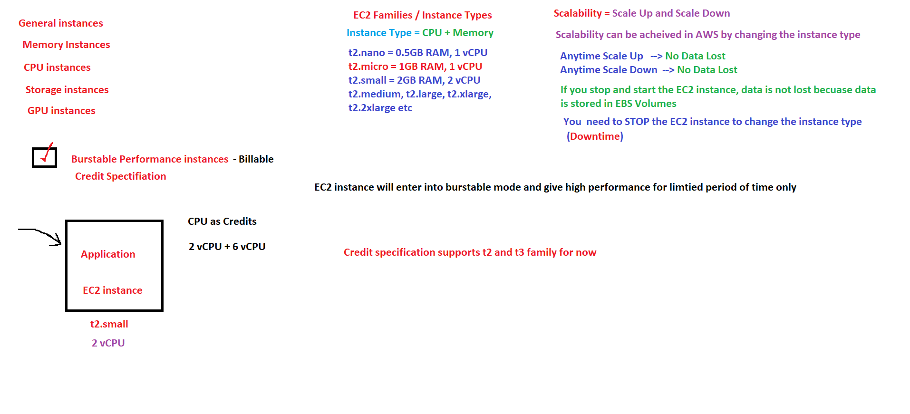
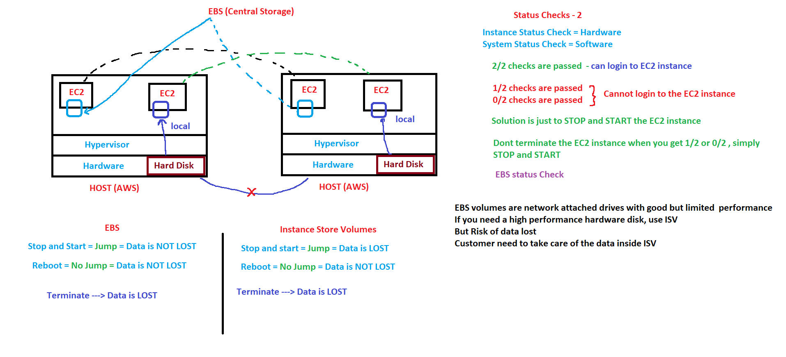
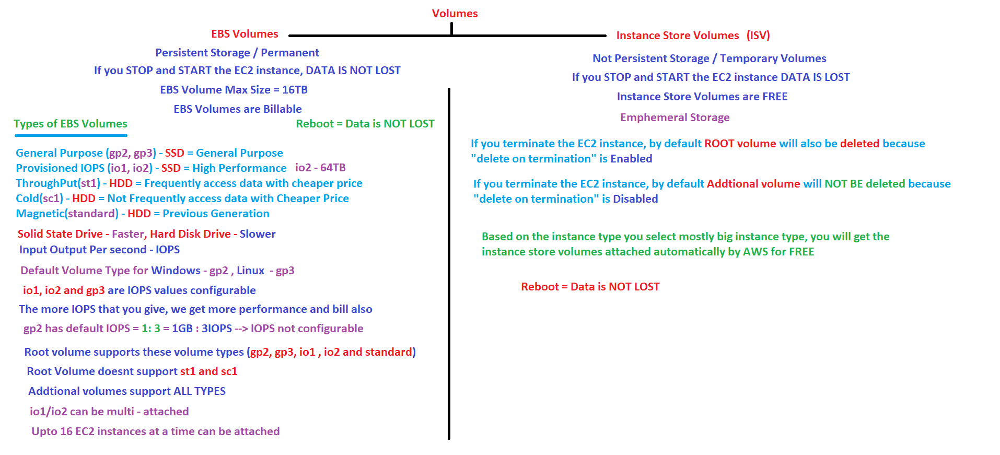
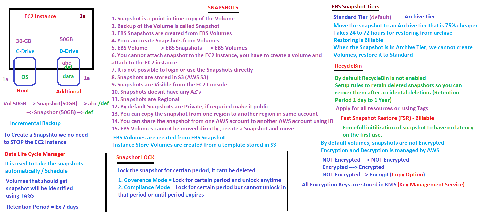
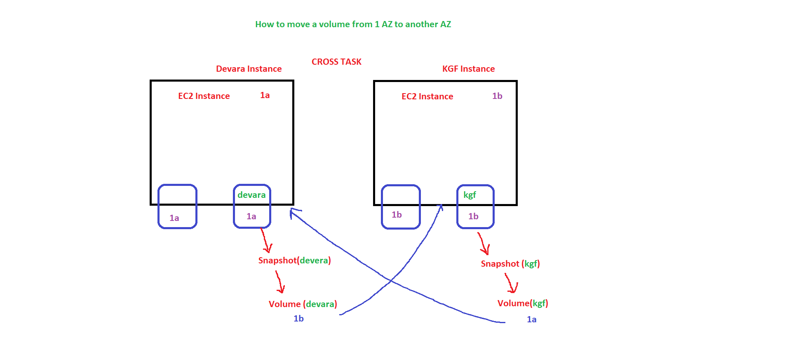
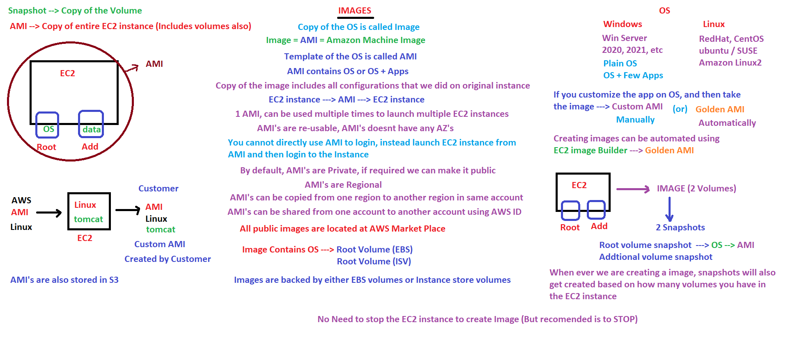
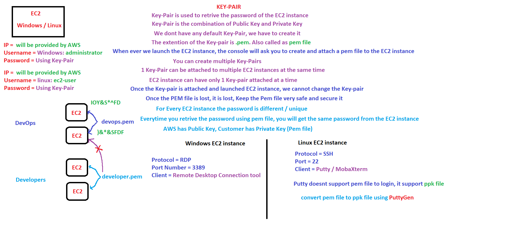
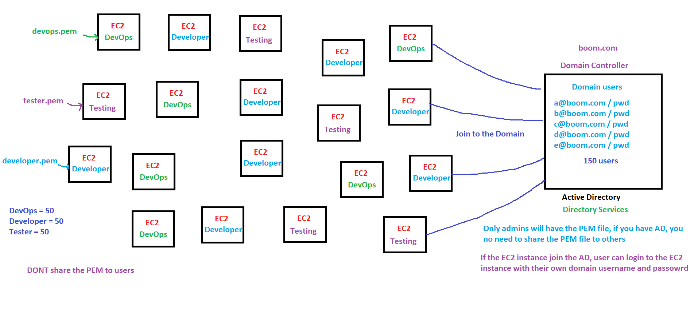
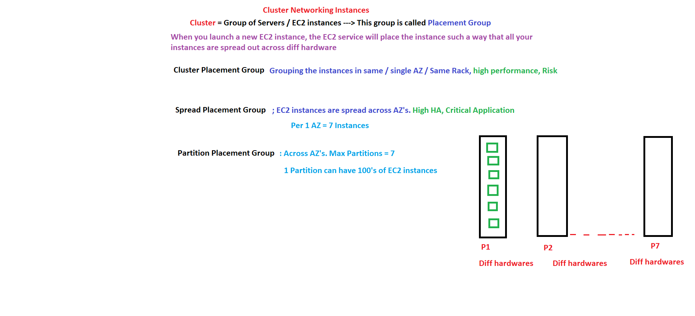

# AWS EC2 Deep Dive: Compute, Storage, Images & Placement

Amazon Elastic Compute Cloud (EC2) is a fundamental web service that provides resizable compute capacity in the cloud. It shifts the infrastructure paradigm from fixed hardware purchases to highly elastic, scalable, virtual machines.

---

## 1. Lifecycle and Billing Dynamics

Understanding how instances are billed and controlled prevents unexpected infrastructure overhead.

* **Billing Rule:** Launching and running an instance incurs costs. **Stopping** or **Terminating** an instance pauses or eliminates compute billing.
* **The "Short-Run" Trap:** If you launch an instance and terminate it within 5 minutes, certain instances or pricing engines bill you for a minimum threshold (e.g., up to a 2-hour floor block or per-second minimums depending on OS type).
* **Instance State Operations:**
  * **Start/Stop:** Pauses execution. The host hardware connection can change ("Jump") upon restart. Data on persistent volumes is retained.
  * **Reboot:** Performs a warm software reset. The virtual machine remains on the same physical host hardware.
  * **Terminate:** Permanently deletes the compute instance.

---

## 2. Infrastructure Pricing Models

AWS provides several purchasing options to optimize compute costs based on predictability, duration, and hardware requirements.

### On-Demand Instances
* **Characteristics:** Fixed hourly rate. Pay strictly for what you use by the hour/second.
* **Commitment:** Zero upfront cost and zero long-term commitment.
* **Best For:** Unpredictable, short-term workloads, or applications being benchmarked for the first time.

### Reserved Instances (RIs)
* **Characteristics:** A long-term commitment offering up to a 72% discount compared to On-Demand rates. RIs can be bought and sold on the open **RI Marketplace**.
* **Commitment Types:** 1-year or 3-year terms. Payment options include *All Upfront*, *Partial Upfront*, or *No Upfront*.
* **Classes:**
  * **Standard RI:** Highest discount (up to 72%), but locked to a specific instance type family.
  * **Convertible RI:** Lower discount (up to 66%), but allows changing instance families, OS types, and tenancies over the lifespan.

### Savings Plans
* **Characteristics:** Offers the same significant discounts as RIs but introduces a flexible dollar-per-hour spend commitment (e.g., "$10/hour for 1 or 3 years").
* **Flexibility:** Automatically applies discounts across instance sizes, OS types, and regions regardless of modifications.

### Spot Instances
* **Characteristics:** Allows bidding on spare, unused AWS compute capacity at steep discounts (up to 90%).
* **Risk:** **AWS can reclaim the capacity with a 2-minute termination notice** if demand spikes.
* **Best For:** Fault-tolerant, stateless architectures, batch processing, and distributed data analytics workloads.

### Instance Tenancy Options
* **Shared Tenancy (Default):** Multiple virtual machines from different customers run on the same physical host hardware managed by a hypervisor.
* **Dedicated Instances:** Instances run on hardware dedicated entirely to a single customer, but instance placement across physical hosts is still managed dynamically by AWS.
* **Dedicated Hosts:** Book an entire physical machine for absolute control. This provides visibility into physical sockets and cores, which is critical for bringing your own licenses (**BYOL**) or satisfying strict compliance frameworks.
* **Capacity Reservations:** Reserves compute capacity in a specific Availability Zone (AZ) for any duration. Guarantees capacity availability without requiring a 1-to-3-year cost-savings commitment.

---

## 3. Instance Families and Scaling Primitives

Instance types are categorized into specialized families optimized for distinct compute profiles.

* **General Purpose:** Balanced compute, memory, and networking (e.g., `t` and `m` families).
* **Compute Optimized:** High-performance processors for batch processing and machine learning inference (e.g., `c` family).
* **Memory Optimized:** Fast performance for large datasets in-memory, such as Redis or SAP HANA (e.g., `r` family).
* **Storage Optimized:** High, sequential read/write access for distributed file systems (e.g., `i` and `d` families).
* **Accelerated Computing (GPU):** Hardware accelerators for graphics processing and massive parallel computing workloads (e.g., `p` and `g` families).

### Performance Adjustments: Scale Up vs. Scale Down
* **Definition:** Vertical scaling achieved by explicitly changing the instance type (e.g., moving from a `t2.micro` to a `t2.small`).
* **Operational Constraint:** To change an instance type, **the EC2 instance must be STOPPED (Downtime required)**.
* **Data Safety:** Data is preserved during vertical resizing because the data resides on persistent external block storage (EBS) volumes.

### Burstable Performance & CPU Credits
* **Mechanism:** The `t2` and `t3` families utilize a credit-specification model. When idle, instances accumulate CPU credits.
* **Burst Mode:** During sudden traffic spikes, the instance consumes accumulated credits to burst beyond baseline performance capacity for a limited window.

---

## 4. Storage Architecture: EBS Volumes vs. Instance Store

EC2 leverages two distinct block-storage options with fundamentally different lifecycles.

### EBS (Elastic Block Store) Volumes
* **Characteristics:** Network-attached virtual hard drives that provide persistent storage. 
* **Data Lifecycle:** Data is **never lost** during a clean `Stop` and `Start` sequence. If an underlying AWS host hardware fails, the instance is migrated ("Jumps") to a healthy host, and the network storage reconnects seamlessly.
* **Reboot Behavior:** Warm software reboot keeps data completely intact.
* **Deletion Properties:** By default, the **Root Volume** has *Delete on Termination* enabled, while **Additional Volumes** have it disabled.

#### Types of EBS Volumes:
1. **General Purpose SSD (`gp2`, `gp3`):** Balanced performance for a wide range of transactional workloads.
   * *gp2:* IOPS scale linearly with volume size ($1\text{ GB} = 3\text{ IOPS}$). IOPS are not independently configurable.
   * *gp3:* Baseline performance of 3,000 IOPS and $125\text{ MB/s}$ throughput are included. Performance values can be scaled independently of volume size.
2. **Provisioned IOPS SSD (`io1`, `io2`):** Highest-performance SSD sub-tier for mission-critical databases. Supports **Multi-Attach**, allowing a single volume to be mounted concurrently to up to 16 nitro-based EC2 instances. Max size for `io2` extends up to 64 TB.
3. **Throughput Optimized HDD (`st1`):** Low-cost magnetic storage optimized for frequently accessed, sequential, streaming workloads like log sets and big data. Cannot be used as a root volume.
4. **Cold HDD (`sc1`):** Lowest-cost volume tier optimized for infrequently accessed archival data clusters. Cannot be used as a root volume.
5. **Magnetic (`standard`):** Previous-generation magnetic infrastructure.

### Instance Store Volumes (ISVs)
* **Characteristics:** NVMe or SSD drives physically attached to the underlying host server hardware. Included for **FREE** on select high-performance instance families.
* **Performance:** Extreme performance with minimal latency compared to network-attached storage.
* **Ephemeral Risk:** **Data is permanently lost if the instance is STOPPED or TERMINATED.** Data only survives a warm software `Reboot`. 
* *Operational Rule:* The customer is responsible for maintaining high-availability software replication layers for data residing inside an Instance Store.

---

## 5. Automated Data Management & Snapshot Governance

An EBS Snapshot is a point-in-time, incremental backup copy of an EBS volume stored securely in Amazon S3.

* **Lifecycle Management:** Snapshots are incremental. Only blocks modified since the last backup are stored. You do not need to stop the instance to run a snapshot.
* **Cross-AZ and Cross-Region Tasks:** EBS volumes are inherently tied to a specific Availability Zone. To migrate a storage volume across AZs or Regions, you must capture a Snapshot, copy it to the destination landscape, and use it to instantiate a new EBS Volume.

[EC2 Volume in AZ-1a] ──> [Create Snapshot] ──> [Copy Snapshot to AZ-1b/Region] ──> [Restore New Volume]

### Advanced Snapshot Capabilities:
* **Data Lifecycle Manager (DLM):** Automates the creation, retention, and deletion of snapshots based on resource tag matching rules.
* **Fast Snapshot Restore (FSR):** Eliminates latency during volume initialization by pre-warming snapshots during restoration.
* **Snapshot Lock:** Prevents accidental deletion of backups for audit and legal compliance.
  * *Governance Mode:* Lock can be deleted early by users with specific administrative IAM permissions.
  * *Compliance Mode:* Strict lock that cannot be deleted or modified by any user, including the root account, until the retention period expires.
* **Recycle Bin:** Provides an accidental-deletion safety net, retaining deleted snapshots for a configurable recovery window (from 1 day to 1 year).
* **Encryption:** Managed via AWS KMS (Key Management Service). Unencrypted volumes can be transformed into encrypted volumes during a Snapshot Copy operation.

---

## 6. Amazon Machine Images (AMIs)

An AMI is a comprehensive template containing the operating system, configuration settings, server software, and application dependencies needed to boot an EC2 instance.

* **Image Backing:** An AMI is a structured package containing pointers to the underlying Root and Additional volume snapshots captured from a golden state server.
* **Classification Types:**
  * **AWS Marketplace:** Pre-built vendor images available to the public.
  * **Custom / Golden AMI:** Standard operating system templates customized manually or automated natively via **EC2 Image Builder** to pre-bake configurations (e.g., pre-installing runtime tools like Apache Tomcat).
* **Scope:** AMIs are Regional resources but can be copied across regions or securely shared with separate corporate AWS account IDs.

---

## 7. Instance Connectivity & Access Management

To connect securely to a newly deployed EC2 instance, you must configure authentication and network protocols.

### Key Pairs
* **Mechanism:** Asymmetric cryptography consisting of a **Public Key** (retained internally by AWS on the instance) and a **Private Key** (downloaded locally by the customer as a `.pem` file).
* **Scope Limits:** A single key pair can be attached to multiple EC2 instances during launch, but **an active instance can only hold 1 key pair at a time**. Once launched, the key pair assignment cannot be modified through the console.
* **Security Rule:** If a `.pem` key file is lost, it cannot be re-downloaded. Keep it secure.

### Connection Protocol Matrix:
* **Windows Connection:** Uses **RDP (Remote Desktop Protocol)** over Port `3389`. Credentials are decrypted using the local private key file to unlock the `administrator` user account.
* **Linux Connection:** Uses **SSH (Secure Shell)** over Port `22` to connect to the shell environment (e.g., `ec2-user`, `ubuntu`). 
  * *Tooling Note:* Third-party terminal tools like PuTTY do not natively read `.pem` files. They require converting the `.pem` file into a `.ppk` file using **PuTTYGen**.

### Enterprise Strategy: Active Directory Joining
Distributing `.pem` key files to hundreds of developers is a massive security risk. In an enterprise setting, EC2 instances are configured to automatically join a central **Active Directory (AD) Domain Controller** via AWS Directory Services. 

Once joined, developers log into the virtual machines using their corporate enterprise network usernames and passwords, eliminating the need to distribute or share raw PEM key files.

---

## 8. Hardware Placement Groups

Placement Groups provide control over how EC2 instances are physically distributed across host racks within the AWS underlying cloud hardware layer.

### Cluster Placement Group
* **Strategy:** Packs instances tightly together within a single Availability Zone on the same physical server rack.
* **Use Case:** High-Performance Computing (HPC) requiring ultra-low network latency and high network throughput.
* **Risk:** High structural risk; if the physical hardware rack experiences a power or network failure, the entire cluster goes down.

### Spread Placement Group
* **Strategy:** Guarantees that each instance is placed on a completely distinct physical hardware rack with independent power and networking infrastructure.
* **Constraint:** Restricted to a maximum limit of **7 instances per Availability Zone**.
* **Use Case:** Small clusters of critical applications that must be completely isolated from simultaneous hardware failures.

### Partition Placement Group
* **Strategy:** Divides the physical infrastructure layout into logical segments called partitions. Instances launched into a partition do not share hardware racks with instances in separate partitions.
* **Parameters:** Supports up to **7 partitions per Availability Zone**, but each partition can hold hundreds of EC2 instances.
* **Use Case:** Large-scale, distributed, topology-aware workloads like Apache Hadoop, HDFS, HBase, and Kafka.

---
